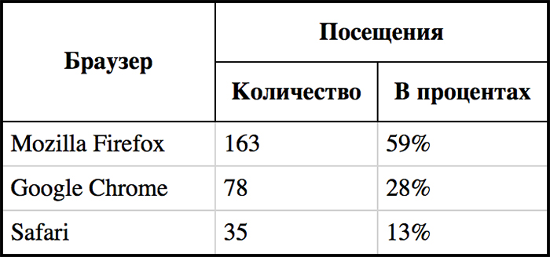
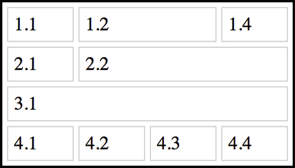
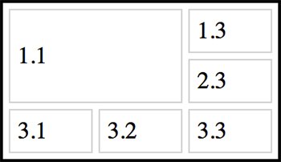

# 4. Знакомство с таблицами

## Простейшая таблица [1/23]

Из всех объектов, которые используются для разметки текста в интернете, таблицы являются самыми сложными для новичков. Действительно, табличные данные приходится публиковать достаточно часто. В отличие от списков, абзацев, заголовков, изображений с таблицами всегда возникает море проблем.
В этом курсе мы узнаем, как с помощью HTML описывать таблицы, научимся делать простые и достаточно сложные таблицы. И, самое главное, научимся аккуратно оформлять таблицы с помощью CSS. Вы увидите, как на самом деле легко и просто работать с таблицами.
Начнём с самого простого. Уберите комментарий в коде редактора и посмотрите на простейшую таблицу из четырёх строк и двух колонок.

HTML
```
<!DOCTYPE html>
<html>
  <head>
    <meta charset="utf-8">
    <title>Простейшая таблица</title>
  </head>
  <body>
    <h1>Распределение браузеров</h1>
    <table border="1">
      <tr>
        <td>Браузер</td>
        <td>Посещения</td>
      </tr>
      <tr>
        <td>Mozilla Firefox</td>
        <td>163</td>
      </tr>
      <tr>
        <td>Google Chrome</td>
        <td>78</td>
      </tr>
      <tr>
        <td>Safari</td>
        <td>35</td>
      </tr>
    </table>
  </body>
</html>
```

## Добавляем строки [2/23]

Простейшая таблица описывается с помощью трёх тегов:
- `<table>` обозначает таблицу.
- `<tr>` расшифровывается как «table row», обозначает строку таблицы.
- `<td>` расшифровывается как «table data», обозначает ячейку внутри строки таблицы.
Теги `<td>` располагаются внутри тегов `<tr>`, а те, в свою очередь, внутри `<table>`. Почти всё текстовое содержимое таблицы размещается внутри тегов `<td>`.
В простейшей таблице в каждой строке должно быть одинаковое количество ячеек, то есть внутри всех `<tr>` должно быть одинаковое количество `<td>`.
Потренируйтесь добавлять строки в таблицу.

HTML
```
<!DOCTYPE html>
<html>
  <head>
    <meta charset="utf-8">
    <title>Добавляем строки</title>
  </head>
  <body>
    <h1>Распределение браузеров</h1>

    <table border="1">
      <tr>
        <td>Браузер</td>
        <td>Посещения</td>
      </tr>
      <tr>
        <td>Mozilla Firefox</td>
        <td>163</td>
      </tr>
      <tr>
        <td>Google Chrome</td>
        <td>78</td>
      </tr>
      <tr>
        <td>Safari</td>
        <td>35</td>
      </tr>
       <tr>
          <td>Opera</td>
          <td>35</td>
      </tr>
      <tr>
        <td>Internet Explorer</td>
        <td>35</td>
      </tr>
    </table>

  </body>
</html>
```

## Добавляем столбцы [3/23]

Со строками справились, теперь потренируемся добавлять в таблицу столбцы.
Для того, чтобы добавить столбец в таблицу, надо в каждую строку `<tr>` добавить по ячейке `<td>`.
В этом задании вам нужно будет в исходную таблицу добавить ещё два столбца. То есть в каждой строке должно быть по четыре ячейки.

HTML
```
<!DOCTYPE html>
<html>
  <head>
    <meta charset="utf-8">
    <title>Добавляем столбцы</title>
  </head>
  <body>
    <h1>Распределение браузеров</h1>

    <table border="1">
      <tr>
        <td>Браузер</td>
        <td>Посещения</td>
        <td>Операционная система</td>
        <td>Посещаемость в процентах</td>
      </tr>
      <tr>
        <td>Mozilla Firefox</td>
        <td>163</td>
        <td>163</td>
        <td>163</td>
      </tr>
      <tr>
        <td>Google Chrome</td>
        <td>78</td>
        <td>163</td>
        <td>163</td>
      </tr>
      <tr>
        <td>Safari</td>
        <td>35</td>
        <td>163</td>
        <td>163</td>
      </tr>
    </table>

  </body>
</html>
```

## Задаём рамки с помощью CSS [4/23]

Вы научились создавать простые таблицы, добавлять в них любое количество строк и столбцов. Теперь пришло время оформить эти таблицы.
Таблицы в предыдущих заданиях отображались с рамками по умолчанию. Такие рамки отображаются, если у тега `<table>` задан атрибут border с ненулевым значением.
Но с помощью атрибута border гибко управлять рамками не получается. С его помощью можно только изменять их толщину.
Поэтому мы будем учиться использовать CSS. С помощью CSS-свойства border можно задавать как внешние рамки таблицы, так и рамки каждой ячейки.
Потренируемся использовать CSS для задания рамок таблицы.

HTML
```
<!DOCTYPE html>
<html>
  <head>
    <meta charset="utf-8">
    <title>Задаём рамки с помощью CSS</title>
  </head>
  <body>
    <h1>Распределение браузеров</h1>
    <table>
      <tr>
        <td>Браузер</td>
        <td>Посещения</td>
      </tr>
      <tr>
        <td>Mozilla Firefox</td>
        <td>163</td>
      </tr>
      <tr>
        <td>Google Chrome</td>
        <td>78</td>
      </tr>
      <tr>
        <td>Safari</td>
        <td>35</td>
      </tr>
    </table>

  </body>
</html>
```

CSS
```
table {
  border: 3px solid black;
}

td {
  border: 3px solid lightgray;
}
```

## Улучшаем отображение рамок [5/23]

Мы задали рамки таблицы с помощью CSS, но они не так хороши, как хотелось бы. По умолчанию браузер рисует рамки таблицы и рамки отдельных ячеек раздельно, это отлично видно на примере.
Чтобы избавиться от таких двойных рамок, используется CSS-свойство таблицы `border-collapse`. Вот так:
``
table {
  border-collapse: collapse;
}
``

Значение `collapse` убирает двойные рамки: cхлопываются рамки соседних ячеек, а также рамки ячеек и внешняя рамка таблицы. При этом внешняя рамка таблицы может исчезнуть, и чтобы её вернуть, можно увеличить её ширину.

CSS
```
table {
  border: 6px solid black;
  border-collapse: collapse;
}

td {
  border: 3px solid lightgray;
}
```

## Горизонтальные и вертикальные рамки [6/23]

Иногда требуется, чтобы рамки ячеек в таблице отображались не полностью. Например, чтобы отображалась только нижняя рамка ячеек, тогда таблица получается расчерченной по горизонтали. Аналогично, если отображать только боковые рамки ячеек, то таблица получается разбитой на столбцы.
Такие эффекты легко достигаются с помощью CSS. Для этого необходимо использовать не свойство border, которое задаёт рамки для всех сторон ячейки, а одно из свойств:
- `border-top`,
- `border-right`,
- `border-bottom`,
- `border-left`.
Эти свойства задают отображение только одной рамки ячейки: верхней, правой, нижней или левой соответственно.
В этом задании вы потренируетесь создавать горизонтально и вертикально расчерченные таблицы.

CSS
```
table {
  border-collapse: collapse;
  border: 3px solid black;
}

td {
  /*border-bottom: 2px solid lightgray;*/
  border-left: 2px solid lightgray;
}
```

## Отступы внутри ячеек [7/23]

Вы освоили простейшие приёмы для работы с рамками таблиц. Наша таблица уже смотрится аккуратно, но содержимое ячеек прилипает к рамкам. Если добавить отступы внутри ячеек, то информация будет восприниматься намного лучше.
Отступы внутри ячеек можно добавлять с помощью атрибута cellpadding тега `<table>`. Но лучше его не использовать, а задавать отступы с помощью CSS.
CSS-свойство `padding` задаёт «внутренние отступы элемента» со всех сторон. Можно задавать отступы для каждой из сторон отдельно, используя свойства:
- `padding-top`,
- `padding-right`,
- `padding-bottom`,
- `padding-left`.
Например, чтобы задать у ячеек все отступы в 10 пикселей, а отступ слева в 20 пикселей, нужно написать такой CSS-код:
```
td {
  padding: 10px;
  padding-left: 20px;
}
```

CSS
```
table {
  border-collapse: collapse;
  border: 3px solid black;
}

td {
  border: 2px solid lightgray;
  padding: 5px;
  padding-right: 30px;
}
```

## Отступы между ячейками [8/23]

Большинство задач по оформлению таблиц решаются с помощью работы с рамками, отступами внутри ячеек, изменения цвета фона ячеек.
Помимо внутренних отступов можно задавать отступы между ячейками таблицы.
Отступы между ячейками не работают с **border-collapse: collapse**, что достаточно логично, ведь рамки ячеек в этом режиме «склеены» и их не разорвать.
Поэтому в этом задании мы используем border-collapse: separate, которое «расклеивает» ячейки. На самом деле это значение по умолчанию, а мы используем его только для наглядности. Если удалить свойство border-collapse, то результат не изменится, ячейки будут отображаться раздельно.
Отступы между ячейками можно задать:
- с помощью атрибута cellspacing тега `<table>`
- или c помощью CSS-свойства `border-spacing`.
Отметим, что свойство `border-spacing` задаётся для таблицы, в отличие от `padding`, которое задаётся для ячеек.

CSS
```
table {
  border-collapse: separate;
  border: 3px solid black;
  border-spacing: 5px;
}

td {
  border: 2px solid lightgray;
  padding: 5px;
}
```

## Испытание: простая, но аккуратная таблица [9/23]

Для того, чтобы пройти это испытание, вам нужно оформить таблицу так же, как в образце. Используйте знания, полученные в пройденных заданиях.
Подсказки:
- Цвет рамок: `lightgray`.
- Стили для `body` менять не надо.
- Использовались только стандартные теги.
- Стили применять только к табличным тегам: `<table>`, `<td>`.
- Размеры отступов кратны 5.
- При стилизации рамок в CSS не забывайте слово `solid`.
Если отображение в мини-браузере сильно отличается от образца, то используйте вкладку «Различия», в которой отображается то, как академия видит ваш HTML-код.

HTML
```
<!DOCTYPE html>
<html>
  <head>
    <meta charset="utf-8">
    <title>Простая, но аккуратная таблица</title>
  </head>
  <body>
    <h1>Посещения по городам</h1>
  <table>
    <tr>
      <td>Город</td>
      <td>Посещения</td>
      <td>Страниц</td>
      <td>Время</td>
    </tr>
    <tr>
      <td>СПб</td>
      <td>199</td>
      <td>18,02</td>
      <td>00:13:45</td>
    </tr>
    <tr>
      <td>Москва</td>
      <td>69</td>
      <td>1,48</td>
      <td>00:00:44</td>
    </tr>
    <tr>
      <td>Киев</td>
      <td>5</td>
      <td>13,43</td>
      <td>00:18:07</td>
    </tr>
  </table>
  </body>
</html>
```

CSS
```
body {
  width: 350px;
  margin: 0;
  padding: 0 10px;
  font-size: 14px;
  font-family: Arial, sans-serif;
}

table {
  border-collapse: collapse;
  border-spacing: 5px;
}

td {
  border-bottom: 2px solid lightgray;
  padding: 10px;
}
```

Ячейки-заголовки [10/23]

Поздравляем! Вы научились создавать простейшие таблицы и оформлять их. В следующей части курса мы познакомимся с ещё несколькими табличными тегами и научимся создавать более сложные таблицы.
Обычно в таблицах выделяют названия столбцов или строк. В HTML для этого предусмотрен специальный тег `<th>`, который расшифровывается как «table header» и обозначает ячейку-заголовок. Тег `<th>` аналогичен `<td>`, он так же должен располагаться внутри `<tr>`, для него стилями можно задавать все те же свойства.
По умолчанию текст внутри `<th>` выделяется жирным и выравнивается по центру ячейки.
В этом задании мы наконец-то добавим в нашу таблицу ячейки-заголовки и оформим их: добавим увеличенные отступы и более яркие рамки.

HTML
```
<!DOCTYPE html>
<html>
  <head>
    <meta charset="utf-8">
    <title>Ячейки-заголовки</title>
  </head>
  <body>
    <h1>Распределение браузеров</h1>

    <table>
      <tr>
        <th>Браузер</th>
        <th>Посещения</th>
        <th>Доля</th>
      </tr>
      <tr>
        <td>Mozilla Firefox</td>
        <td>163</td>
        <td>59%</td>
      </tr>
      <tr>
        <td>Google Chrome</td>
        <td>78</td>
        <td>28%</td>
      </tr>
      <tr>
        <td>Safari</td>
        <td>35</td>
        <td>13%</td>
      </tr>
    </table>

  </body>
</html>
```

CSS
```
table {
  border-collapse: collapse;
  border: 2px solid black;
}

td {
  padding: 5px;
  padding-right: 30px;
  border: 1px solid lightgray;
}

th {
  padding: 10px;
  border: 1px solid black;
}
```

## Заголовок таблицы [11/23]

В предыдущем задании вы создали заголовочные ячейки с помощью подходящих тегов, в этом задании мы создадим подпись к таблице (или заголовок таблицы).
Сейчас подпись Распределение браузеров сделана с помощью заголовка первого уровня. В принципе, можно догадаться, что это название таблицы, но семантически правильнее будет сделать это название с помощью тега `<caption>`.
Тег `<caption>` должен размещаться внутри тега `<table>`, причём непосредственно внутри него и первым, до остальных вложенных тегов. Вот так:
```
<table>
  <caption>Текст</caption>
  ...
</table>
```

Тег заголовка идёт первым внутри таблицы, но с помощью CSS можно переместить заголовок таблицы в любое место: сверху или снизу таблицы, по центру, справа или слева.
По вертикали заголовок таблицы перемещается CSS-свойством caption-side со значениями top и bottom, которые обозначают до и после таблицы соответственно.
По горизонтали заголовок таблицы выравнивается CSS-свойством text-align со значениями left, right и center.

HTML
```
<!DOCTYPE html>
<html>
  <head>
    <meta charset="utf-8">
    <title>Заголовок таблицы</title>
  </head>
  <body>
    <table>
      <caption>Распределение браузеров</caption>
      <tr>
        <td>Браузер</td>
        <td>Посещения</td>
        <td>Доля</td>
      </tr>
      <tr>
        <td>Mozilla Firefox</td>
        <td>163</td>
        <td>59%</td>
      </tr>
      <tr>
        <td>Google Chrome</td>
        <td>78</td>
        <td>28%</td>
      </tr>
      <tr>
        <td>Safari</td>
        <td>35</td>
        <td>13%</td>
      </tr>
    </table>

    </body>
</html>
```

CSS
```
table {
  border-collapse: collapse;
  border: 2px solid black;
}

td {
  padding: 5px;
  padding-right: 30px;
  border: 1px solid lightgray;
}

th {
  padding: 10px;
  border: 1px solid black;
}

caption {
  caption-side: bottom;
  text-align: left;
}
```

## Объединяем ячейки в строках [12/23]

Мы подобрались к одному из самых сложных вопросов по работе с таблицами. Это объединение ячеек.
Когда вы объединяете ячейки в текстовом редакторе, например, Word, то программа многое делает за вас. В чистом HTML задача объединения сложнее, однако, не стоит пугаться, сам принцип объединения ячеек не так уж сложен, просто нужно больше внимательности.
Исходная таблица в примере не очень красива, но с помощью объединения ячеек мы сделаем сложный заголовок таблицы, вот такой:


Начнём с объединения ячеек по горизонтали. Чтобы объединить ячейки по горизонтали, необходимо использовать атрибут `colspan` у тегов `<th>` или `<td>`.
Когда вы задаёте ячейке атрибут `colspan` со значением `2`, то ячейка как бы «растягивается» на ячейку справа, но та ячейка не исчезает, а отодвигается и в таблице появляется новый столбец. Чтобы удалить его, нужно удалить ячейку, которая находится справа от «растянутой».
Легче сделать и посмотреть, чем объяснять. Приступим.

HTML
```
<!DOCTYPE html>
<html>
  <head>
    <meta charset="utf-8">
    <title>Объединяем ячейки в строках</title>
  </head>
  <body>
    <table>
      <caption>Распределение браузеров</caption>
      <tr>
        <th>Браузер</th>
        <th colspan=2>Посещения</th>

      </tr>
      <tr>
        <th></th>
        <th>Количество</th>
        <th>В процентах</th>
      </tr>
      <tr>
        <td>Mozilla Firefox</td>
        <td>163</td>
        <td>59%</td>
      </tr>
      <tr>
        <td>Google Chrome</td>
        <td>78</td>
        <td>28%</td>
      </tr>
      <tr>
        <td>Safari</td>
        <td>35</td>
        <td>13%</td>
      </tr>
    </table>
  </body>
</html>
```

CSS
```
table {
  border-collapse: separate;
  border: 2px solid black;
  border-spacing: 4px;
}

td {
  padding: 5px;
  padding-right: 30px;
  border: 1px solid lightgray;
}

th {
  padding: 10px;
  border: 1px solid black;
}

caption {
  margin-bottom: 10px;
  font-size: 18px;
}

.pink {
  background-color: pink;
}
```

## Объединяем ячейки в столбцах [13/23]

Объединение ячеек по вертикали немного сложнее. Оно осуществляется с помощью атрибута rowspan у тега `<td>` или `<th>`.
Когда вы задаёте ячейке атрибут rowspan со значением 2, то ячейка как бы «растягивается» на следующую строку. При этом ячейка, которая была под «растянутой» отодвигается в своей же строке вправо, что добавляет в таблицу лишний столбец. Удалив ячейку, которая была под «растянутой» мы избавимся от этого столбца.
В задании всё будет очень наглядно. Мы объединим ячейку «Браузер» с ячейкой снизу, а затем поправим CSS-код, чтобы получить тот результат, который изображён на картинке:



HTML
```
<!DOCTYPE html>
<html>
  <head>
    <meta charset="utf-8">
    <title>Объединяем ячейки в столбцах</title>
  </head>
  <body>
    <table>
      <caption>Распределение браузеров</caption>
      <tr>
        <th rowspan=2>Браузер</th>
        <th colspan="2">Посещения</th>
      </tr>
      <tr>
        <th>Количество</th>
        <th>В процентах</th>
      </tr>
      <tr>
        <td>Mozilla Firefox</td>
        <td>163</td>
        <td>59%</td>
      </tr>
      <tr>
        <td>Google Chrome</td>
        <td>78</td>
        <td>28%</td>
      </tr>
      <tr>
        <td>Safari</td>
        <td>35</td>
        <td>13%</td>
      </tr>
    </table>
  </body>
</html>
```

CSS
```
table {
  border-collapse: collapse;
  border: 2px solid black;
  border-spacing: 4px;
}

td {
  padding: 5px;
  padding-right: 30px;
  border: 1px solid lightgray;
}

th {
  padding: 10px;
  border: 1px solid black;
}

caption {
  margin-bottom: 10px;
  font-size: 18px;
}

.pink {
  background-color: pink;
}
```

## Закрепление colspan [14/23]

Можно ли объединять более двух ячеек по горизонтали? Можно! При этом точно так же используется атрибут colspan. Однако, так как ячейка «растягивается» вправо больше, чем на одну соседнюю ячейку, то и лишних столбцов появляется больше.
Например, если установить colspan равным 4, то ячейка растянется на три соседние ячейки справа, а они в свою очередь сместятся, добавив в таблицу три столбца.
В этом задании вы потренируетесь объединять различное число ячеек. Ячейки, помеченные розовым фоном, будут смещаться, и их надо будет удалять. Вот, что должно получиться:



HTML
```
<!DOCTYPE html>
<html>
  <head>
    <meta charset="utf-8">
    <title>Закрепление colspan</title>
  </head>
  <body>
    <table>
      <tr>
        <td>1.1</td>
        <td colspan=2>1.2</td>
        <td>1.4</td>
      </tr>
      <tr>
        <td>2.1</td>
        <td colspan=3>2.2</td>
      </tr>
      <tr>
        <td colspan=4>3.1</td>
      </tr>
      <tr>
        <td>4.1</td>
        <td>4.2</td>
        <td>4.3</td>
        <td>4.4</td>
      </tr>
    </table>
  </body>
</html>
```

CSS
```
table {
  border-collapse: separate;
  border: 2px solid black;
  border-spacing: 4px;
}

td {
  padding: 5px;
  padding-right: 30px;
  border: 1px solid lightgray;
}

.pink {
  background-color: pink;
}
```

## Закрепление rowspan [15/23]

Объединение нескольких ячеек по вертикали тоже возможно. Как вы помните, при вертикальном объединении вытесняются ячейки, которые находятся в строках под «растягиваемой» ячейкой. И эти ячейки вытесняются справа в своих строках.
В этом задании вы потренируетесь объединять по вертикали разное число ячеек. Для удобства восприятия ячейки, которые будут вытесняться в каждом из столбцов, помечены разными цветами. Вам нужно будет устанавливать свойство rowspan у нужных ячеек и удалять ячейки соответствующего цвета. Получиться должно следующее:

HTML
```
<!DOCTYPE html>
<html>
  <head>
    <meta charset="utf-8">
    <title>Закрепление rowspan</title>
  </head>
  <body>
    <table>
      <tr>
        <td rowspan=4>1.1</td>
        <td>1.2</td>
        <td rowspan=3>1.3</td>
        <td>1.4</td>
      </tr>
      <tr>
        <td rowspan=2>2.2</td>
        <td>2.4</td>
      </tr>
      <tr>
        <td>3.4</td>
      </tr>
      <tr>
        <td>4.2</td>
        <td>4.3</td>
        <td>4.4</td>
      </tr>
    </table>
  </body>
</html>
```

CSS
```
table {
  border-collapse: separate;
  border: 2px solid black;
  border-spacing: 4px;
}

td {
  padding: 5px;
  padding-right: 30px;
  border: 1px solid lightgray;
}

.pink {
  background-color: pink;
}

.green {
  background-color: lightgreen;
}

.blue {
  background-color: lightblue;
}
```

## Комбо: colspan + rowspan [16/23]

Можно растягивать ячейку одновременно и по вертикали, и по горизонтали. Для этого нужно задать ячейке два атрибута: `rowspan` и `colspan`.
Вытеснение соседних ячеек будет происходить так же, как и при обычном объединении ячеек. Правда, вытесненных ячеек окажется больше. Например, ячейка с `rowspan="2"` и `colspan="2"` вытеснит три соседних ячейки.
Этот случай из тех, которые легче объяснить на примере, чем на словах. В этом задании вы растянете ячейку на два столбца и две строки и сами увидите, как поведёт себя таблица. В результате получится:



HTML
```
<!DOCTYPE html>
<html>
  <head>
    <meta charset="utf-8">
    <title>Комбо: colspan + rowspan</title>
  </head>
  <body>
    <table>
      <tr>
        <td colspan=2 rowspan=2>1.1</td>
        <td>1.3</td>
      </tr>
      <tr>
        <td>2.3</td>
      </tr>
      <tr>
        <td>3.1</td>
        <td>3.2</td>
        <td>3.3</td>
      </tr>
    </table>
    </body>
</html>
```

CSS
```
table {
  border-collapse: separate;
  border: 2px solid black;
  border-spacing: 4px;
}

td {
  padding: 5px;
  padding-right: 30px;
  border: 1px solid lightgray;
}

.pink {
  background-color: pink;
}
```

## Испытание: таблица посложнее [17/23]

В этом испытании таблица похожа на ту, что была в предыдущем испытании. В эту таблицу добавились те элементы, с которыми вы познакомились в предыдущих заданиях.
Закрепите ваши навыки объединения ячеек, а также использования ячеек-заголовков и заголовка таблицы.
Подсказки:
- Цвета рамок: `lightgray` и `black`.
- Стили для `body` менять не надо.
- Размеры отступов кратны `5`.

<a href="solutions/challenge-1/index.html">HTML solution</a>
<a href="solutions/challenge-1/main.css">CSS solution</a>

## Выравнивание содержимого в ячейках [18/23]

Содержимое ячеек можно выравнивать по горизонтали и по вертикали с помощью CSS.
За выравнивание по горизонтали отвечает CSS-свойство `text-align`. Чаще всего используются значения `left`, `center` и `right`.
За выравнивание по вертикали отвечает CSS-свойство `vertical-align`. Чаще всего используются значения `top`, `middle` и `bottom`.
На самом деле, значений у обоих свойств больше, но в случае с ячейками нас интересуют только перечисленные.
Чтобы задать выравнивание содержимого ячеек, надо в стилях указать:
```
td {
  vertical-align: значение;
  text-align: значение;
}
```

Эти стили повлияют на все ячейки. Чтобы задать выравнивание только в определённых ячейках, нужно назначить им классы и определить стили для классов. В этом примере для вас уже подготовлены ячейки с классами.

HTML
```
<!DOCTYPE html>
<html>
  <head>
      <meta charset="utf-8">
      <title>Выравнивание содержимого в ячейках</title>
  </head>
  <body>
    <table>
      <caption>Распределение браузеров</caption>
      <tr>
        <th class="cell-1" rowspan="2">Браузер</th>
        <th colspan="2">Посещения</th>
      </tr>
      <tr>
        <th>Количество</th>
        <th>В процентах</th>
      </tr>
      <tr>
        <td>Mozilla Firefox</td>
        <td class="column-2">1263</td>
        <td class="column-3">75%</td>
      </tr>
      <tr>
        <td>Google Chrome</td>
        <td class="column-2">78</td>
        <td class="column-3">5%</td>
      </tr>
      <tr>
        <td>Safari</td>
        <td class="column-2">345</td>
        <td class="column-3">20%</td>
      </tr>
    </table>
  </body>
</html>
```

CSS
```
.cell-1 {
  vertical-align: bottom;
}

.column-2 {
  text-align: right;
}

.column-3 {
  text-align: center;
}

table {
  border-collapse: collapse;
  border: 2px solid black;
}

td {
  padding: 5px;
  padding-right: 10px;
  border: 1px solid lightgray;
}

th {
  padding: 10px;
  border: 1px solid black;
}

caption {
  margin-bottom: 10px;
  font-size: 18px;
}
```

## Добавим цвета [19/23]

В этом задании мы раскрасим нашу скучную чёрно-белую таблицу. Таблицы можно раскрашивать, задавая цвет фона ячеек, цвет текста в ячейках, а также цвет рамок. Можно задавать и фоновые изображения, но это мы разберём в последующих курсах.
Цветами можно управлять с помощью этих свойств:
- `background-color` — задаёт цвет фона,
- `color` — цвет текста,
- `border-color` — цвет рамок.
До этого мы использовали компактную форму для описания рамок: `border: 1px solid lightgray`. В этой записи цвет задаёт третья часть — `lightgray`.
Значения цветов в CSS задаются разными способами. Мы будем использовать ключевые слова для описания цвета.
Таким образом, чтобы задать цвета для ячейки в CSS, нужен такой код:
```
td {
  color: цвет;
  background-color: цвет;
  border: 1px solid цвет;
}
```

Конечно, раскрашивать можно и `td`, и `th`, и даже `table`. Приступим!

CSS
```
table {
  border-collapse: collapse;
  border: 2px solid black;
}

td {
  padding: 5px;
  padding-right: 10px;
  border: 1px solid lightgray;
  color: brown;
  background-color: lightyellow;
}

th {
  padding: 10px;
  border: 1px solid black;
  color: darkblue;
  background-color: lightcyan;
}

caption {
  margin-bottom: 10px;
  font-size: 18px;
}
```

## Раскрашиваем строки [20/23]

В предыдущем задании вы раскрасили ячейки и ячейки-заголовки с помощью CSS. Если задавать стили для тега, например, `th` или `td`, то они применятся ко всем тегам. В нашем примере все ячейки окрасились в светло-жёлтый, а все ячейки-заголовки в светло-голубой.
Как быть, если стили нужно задать для какой-то определённой ячейки, группы ячеек, или строки? Можно использовать классы и применять стили для этих классов. Например, вот так:
```
.my-class {
  стили
}
```

В этом задании мы раскрасим в разные цвета строки таблицы. Для этого воспользуемся классами, которые уже заданы для строк в примере.

HTML
```
<!DOCTYPE html>
<html>
  <head>
    <meta charset="utf-8">
    <title>Раскрашиваем строки</title>
  </head>
  <body>
    <table>
      <caption>Распределение браузеров</caption>
      <tr>
        <th rowspan="2">Браузер</th>
        <th colspan="2">Посещения</th>
      </tr>
      <tr>
        <th>Количество</th>
        <th>В процентах</th>
      </tr>
      <tr class="row-1">
        <td>Mozilla Firefox</td>
        <td>126</td>
        <td>59%</td>
      </tr>
      <tr class="row-2">
        <td>Google Chrome</td>
        <td>78</td>
        <td>28%</td>
      </tr>
      <tr class="row-3">
        <td>Safari</td>
        <td>34</td>
        <td>13%</td>
      </tr>
    </table>
  </body>
</html>
```

CSS
```
.row-1 {
  background-color: pink;
}

.row-2 {
  background-color: lightgreen;
}

.row-3 {
  background-color: lightblue;
}

table {
  border-collapse: collapse;
  border: 2px solid black;
}

td {
  padding: 5px;
  padding-right: 10px;
  border: 1px solid lightgray;
}

th {
  padding: 10px;
  border: 1px solid black;
}

caption {
  margin-bottom: 10px;
  font-size: 18px;
}
```

## Задаём размеры таблицы [21/23]

По умолчанию ширина и высота таблицы зависит от содержимого и отступов внутри ячеек. Чем меньше содержимого, тем меньше размеры таблицы.
С помощью CSS можно управлять размерами таблицы, задавать желаемую ширину и высоту. Также размерами можно управлять с помощью атрибутов таблицы, но мы рассмотрим только CSS.
Стоит отметить, что у таблицы есть минимальные размеры, которые зависят от содержания, меньше которых она не сожмётся, какое бы значение ширины или высоты ни задавалось.
Ширина таблицы задаётся с помощью CSS-свойства `width`, а высота с помощью свойства `height`, например:
```
table {
  width: 100px;
  height: 100px;
}
```

Размеры таблицы можно задавать как в абсолютных единицах, например, в пикселях — `20px`, так и в относительных, в процентах — `20%`.
При использовании процентов размеры таблицы будут вычисляться с учётом размеров родительского элемента, в нашем случае окна мини-браузера.
Особое значение `auto` включает расчёт размеров по умолчанию. Например, `width: auto`; или `height: auto`;.
Важное замечание. Проценты при задании высоты обычно не работают.

HTML
```
<!DOCTYPE html>
<html>
  <head>
    <meta charset="utf-8">
    <title>Задаём размеры таблицы</title>
  </head>
  <body>
    <table>
      <caption>Распределение браузеров</caption>
      <tr>
        <th>Браузер</th>
        <th>Посещения</th>
        <th>%</th>
      </tr>
      <tr class="row1">
        <td>Mozilla Firefox</td>
        <td>126</td>
        <td>59%</td>
      </tr>
      <tr class="row2">
        <td>Google Chrome</td>
        <td>78</td>
        <td>28%</td>
      </tr>
      <tr class="row3">
        <td>Safari</td>
        <td>34</td>
        <td>13%</td>
      </tr>
    </table>
  </body>
</html>
```

CSS
```
table {
  width: 100%;
  height: 250px;
  border-collapse: collapse;
}

td {
  padding: 5px;
  padding-right: 10px;
  border: 1px solid black;
}

th {
  padding: 10px;
  border: 1px solid black;
}

caption {
  margin-bottom: 10px;
  font-size: 18px;
}
```

## Задаём размеры отдельных ячеек и столбцов [22/23]

Размеры ячеек и столбцов тоже можно задавать вручную, особенно если вам не нравится, как браузер распределил ширину колонок. Размеры ячеек задаются точно так же, как и размеры таблицы: с помощью CSS-свойств `width` и `height`.
Есть два варианта добавления стилей ячейкам:
- Назначать ячейкам уникальные имена классов, например, `class="cell-11"`, и применять стили для этих классов.
- Использовать атрибут `style`, внутри которого можно писать CSS-код.
Пример второго варианта:
```
<td style="width: 100px;">
  ...
</td>
```

К счастью, редко нужно задавать размеры каждой ячейки. Обычно размеры ячеек прописывают, когда надо вручную установить ширину столбцов таблицы: для этого достаточно задать ширину для каждой ячейки из первой строки.
В этом задании вы зададите ширину столбцов, используя атрибут `style`. А также увидите отличия между шириной столбцов по умолчанию и заданной вручную.

HTML
```
<!DOCTYPE html>
<html>
  <head>
    <meta charset="utf-8">
    <title>Задаём размеры отдельных ячеек и столбцов</title>
  </head>
  <body>
    <table>
      <caption>Распределение браузеров</caption>
      <tr>
        <th style="width: 70%">Браузер</th>
        <th style="width: 15%">∑</th>
        <th style="width: 15%">%</th>
      </tr>
      <tr class="row1">
        <td>Mozilla Firefox</td>
        <td>126</td>
        <td>59%</td>
      </tr>
      <tr class="row2">
        <td>Google Chrome</td>
        <td>78</td>
        <td>30%</td>
      </tr>
      <tr class="row3">
        <td>Safari</td>
        <td>34</td>
        <td>11%</td>
      </tr>
    </table>
  </body>
</html>
```

CSS
```
table {
  width: 100%;
  border-collapse: collapse;
}

td {
  padding: 5px;
  padding-right: 10px;
  border: 1px solid black;
}

th {
  padding: 10px;
  border: 1px solid black;
}

caption {
  margin-bottom: 10px;
  font-size: 18px;
}
```

## Испытание: итоговая таблица [23/23]

Поздравляем! Вы практически окончили курс. В нём вы научились базовым приёмам работы с таблицами. Хотя в этом деле ещё миллион тонкостей, изученных приёмов должно хватить для решения 95% задач по созданию и оформлению таблиц.
Сейчас осталось лишь подтвердить, что вы хорошо освоили материал. В образце, который вам надо сверстать, были использованы почти все приёмы из этого курса.
Небольшие подсказки:
- Стили для body менять не надо.
- Используемые цвета: `darkcyan`, `lightblue`, `lightyellow`, `lightgray`, `black`, `white`.
- Ширина ячеек: `33%`.
- Размеры отступов кратны `5`.
- Цвет текста задаётся с помощью CSS-свойства color.
- Тег `caption` использовать не нужно.

<a href="solutions/challenge-2/index.html">HTML solution</a>
<a href="solutions/challenge-2/main.css">CSS solution</a>